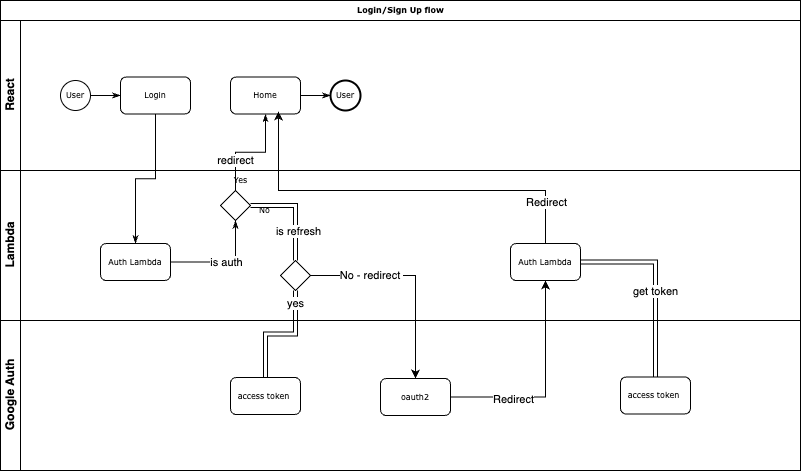
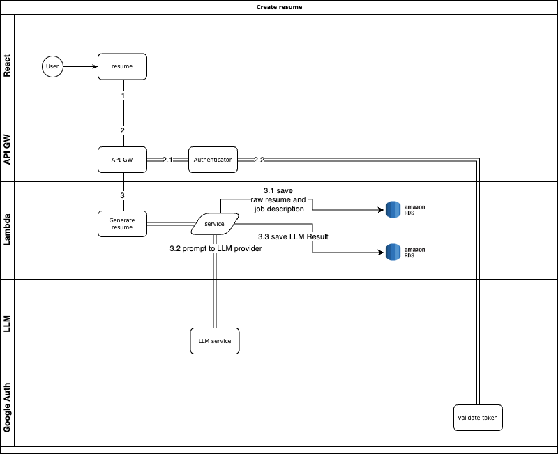

# AI-Resume-Builder

Unlock the power of AI to create personalized, professional resumes that highlight your unique skills, experience, and achievements. Our AI-powered resume generator is designed to streamline the resume-building process, making it easy for users to craft a standout resume tailored to their industry and career goals. With intelligent formatting, skill-based recommendations, and job-specific keyword optimization, this tool ensures every resume is crafted to captivate recruiters and pass through Applicant Tracking Systems (ATS) with ease.

Whether you're an entry-level candidate or an executive, our AI resume generator adapts to your needs, showcasing your strengths in a polished and impactful way. Simply input your career details, and watch as AI assembles a tailored resume that emphasizes what matters most, giving you a competitive edge in today's job market. Get noticed, get hired—effortlessly.

[Link to website](https://main.d496augql7sjq.amplifyapp.com)

## Table of Contents

- [Flow](#flow)
- [Prerequisites](#prerequisites)
- [Setup](#setup)
  - [Backend](#backend)
  - [Frontend](#frontend)
- [Running with Docker](#running-with-docker)
- [License](#license)

## Flow

### Auth flowchart



### Resume flowchart



## Prerequisites

- Node.js
- Docker

## Setup

### Backend

[Setup](./backend/README.md)

### Frontend

[Setup](./frontend/README.md)

## Running with Docker

1. Ensure Docker and Docker Compose are installed on your machine.

2. Build and start the services:
   ```sh
   docker-compose up --build
   ```

## Usage

- Access the web application at `http://localhost:3000`.
- The backend API will be available at `http://localhost:3001`.

## License

This project is licensed under the MIT License - see the [LICENSE](LICENSE) file for details.
